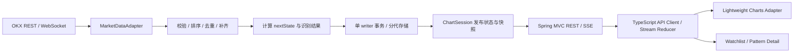

# Trading Coach MVP 技术设计

状态：设计提案，尚未实现应用。日期：2026-10-06。

本目录将《Trading Coach MVP 技术与产品交接文档》细化为前端、后端、行情和算法的开发依据。后端已选定 Java，前端采用 TypeScript；视觉样式尚未确定，设计只规定交互、信息和主题接口。

## 1. 文档导航

| 文档 | 回答的问题 |
| --- | --- |
| [前端技术架构](frontend/architecture.md) | 页面、TypeScript 模块、图表适配、状态和实时更新如何组织 |
| [后端技术架构](backend/architecture.md) | 四层职责、依赖方向、包结构、调用链，以及运行、存储和部署如何组织 |
| [数据源设计与分支参考](backend/market-data-design.md) | 旧分支哪些设计可复用，首个市场如何接入 |
| [前后端数据契约](shared/api-contracts.md) | Candle、Pattern、快照、REST 和 SSE 的统一语义 |
| [技术识别规则](backend/technical-engine-spec.md) | Swing、结构、突破和状态机的规则与测试标准 |
| [版本一致性与恢复](backend/consistency-and-recovery.md) | 重建如何统一发布、失败后如何恢复、元数据如何固定 |
| [运行与发布维护](backend/operations.md) | 容量上限、备份恢复、升级回滚和运行验收 |

推荐按本页、数据源、契约、算法、后端、一致性、前端、运行维护的顺序阅读。

## 2. MVP 范围

首个可交付 MVP：Web 图表 + Crypto 现货 + BTC/ETH + 市场结构 + Breakout + 可解释详情。

- 周期：`1m / 5m / 15m / 1h / 4h / 1d`。
- 图表：K 线、成交量、历史分页、缩放、拖动、十字线、OHLC、标的/周期切换。
- 技术识别：确认后的 Swing、HH/HL/LH/LL、趋势状态、支撑阻力参考位。
- 突破：向上/向下、生命周期、确认和失效证据、图上点击详情。
- 页面：简单 Watchlist、Chart、Pattern Detail。详情可以先用侧栏，无需独立路由。
- 实时：更新当前 K 线，收盘推进算法，断线补齐和明确的数据状态。

Retest、Range 形态、Continuation、Reversal 为后续扩展，不阻塞首版交付。首版的 `RANGE` 趋势标签表示规则定义的横向结构，不表示已经实现 Range Pattern。Android、AI 解释、新闻、交易、回测和用户端 Replay 暂不实现。

## 3. 核心架构决策

| 决策 | MVP 选择 | 原因 / 边界 |
| --- | --- | --- |
| 前端 | React + TypeScript strict + Vite | 交接文档推荐，并能参考现有 React 分支 |
| 图表 | TradingView Lightweight Charts，实施时锁定稳定主版本 | 只负责渲染；复杂标注由 Adapter / Primitive 完成 |
| UI 样式 | CSS Modules + CSS 变量作为基础接口 | 暂不锁定组件库、配色或视觉风格 |
| 后端 | Java 21 LTS、Spring Boot 4.1.x、Spring MVC、Jackson、Jakarta Validation | 用户已选定 Java，沿用 Android / Java 开发经验，降低长期维护和迭代成本 |
| Java 命名空间 | Gradle group 与根包统一使用 `com.marketlens` | 使用常规的 `com.项目名` 形式；产品名仍为 Trading Coach |
| 后端分层 | 接口层 → 应用层 → 领域层；基础设施实现应用端口，启动入口负责装配 | 一个 Gradle 应用模块，通过包边界隔离协议、流程、规则与外部系统；见 [分层设计](backend/architecture.md#2-分层架构与代码组织) |
| 构建 / 测试 | Gradle Wrapper、Java toolchain 21、JUnit | 版本在实施时锁定；测试框架版本跟随 Spring Boot 依赖管理 |
| 算法归属 | 后端纯函数 / 状态引擎，后端输出权威结果 | 避免浏览器、Android 和服务端出现不同判定 |
| 浏览器数据连接 | REST + SSE | 需求是单向推送，可复用已有分支设计 |
| 上游数据连接 | 交易所 REST + WebSocket | 与浏览器 SSE 是不同链路，不要求协议一致 |
| 首个真实源 | OKX 公共现货行情，BTC-USDT / ETH-USDT | 已有 OKX 下载实现可参考；可用性待联调验证 |
| 替代源 | Binance Spot Adapter 后续接入 | 独立数据序列；不自动拼接不同交易所 K 线 |
| 存储 / 部署 | SQLite WAL + Spring JDBC，单 JVM 应用实例，同域静态 Web | 单实例内有多个受控线程和后台任务；控制 MVP 运维成本 |
| Mock | 明确的独立运行模式 | 网络故障保留真实最后值和状态，不静默换成模拟行情 |
| 数据一致性 | ACTIVE / BUILDING 分代存储，统一发布指针 | 历史、详情、图表和推送使用同一代，禁止暴露半成品 |
| 处理状态 | 与行情连接状态独立的 processing | 行情正常时仍能明确显示识别暂停或重建 |
| 历史浏览 | 公共 500 根实时窗口 + 客户端独立历史分页 | 多个浏览器的可视范围互不影响 |
| 可复现性 | 算法、参数、数据、分析起点和元数据版本共同固定 | tickSize 变化不能悄悄改变历史识别结果 |

后端 Java、前端 TypeScript 是已确定的语言选择。后端采用模块化单体，行情、算法、存储和 API 通过接口隔离；先保持一个可部署服务。旧 Python 分支只作为数据映射、协议和行为参考，算法与适配器按 Java 契约实现。首版不引入 Redis、Kafka、vn.py 或跨语言常驻服务。

## 4. 数据流



上图表示运行时数据处理顺序；持久化由应用用例协调，Engine 不调用 Repository。代码依赖方向见 [后端分层](backend/architecture.md#22-依赖方向)。

Technical Engine 是不依赖 Spring、数据库、网络或图表库的纯 Java 模块。前端 Chart Adapter 不参与突破判断；显示证据字段，并根据语义状态生成视觉标注。

## 5. 与已有仓库的关系

`quant-claw` 面向策略提案、风控和执行；Trading Coach 面向图表和学习。当前仓库仍作为方案文档仓库，新文档放在 `docs/trading-coach/`。

按用户要求，两端使用不同路径。当前设计目录与未来应用目录对应如下：

```text
docs/trading-coach/                 trading-coach/（未来实现）
  frontend/                          frontend/  # React / TypeScript
  backend/                           backend/   # Java / Spring Boot / 行情 / 算法
  shared/                            contracts/ # schema 源文件、生成类型与 fixtures
```

`shared/` 保存共用接口定义，不把前后端实现混在一起。不将现有两个分支整体合入，不引入旧系统的订单、日记、清单、策略进化或多 Agent 链路。数据适配模式和基础设施思路可参考，行情契约需要重建。

## 6. 实施阶段与验收

| 阶段 | 交付 | 验收 |
| --- | --- | --- |
| P0：契约与离线图表 | 机器可读 schema、SQL migration、固定 fixture、契约验证、Web K 线和成交量 | 六个周期来自正确数据，切换不串图；类型生成和实际序列化一致 |
| P1：结构引擎 | 后端 Swing / Structure、标记、趋势证据 | 无未来数据泄漏；固定样本和逐根输入测试通过 |
| P2：真实行情 | OKX REST / WS、缓存、SSE、断线补齐 | 历史/实时接续、重复和乱序处理、收盘一致性通过 |
| P3：Breakout 闭环 | 状态机、标注、详情、状态历史 | 向上/向下、失败、过期、失效、重复检测通过 |
| P4：交付验证 | Watchlist、同域部署、容量测量、备份恢复及升级脚本、使用观察 | 恢复 / 回滚演练通过；新用户能从详情说出识别依据、确认条件和失效条件 |

P0/P1 可以用 fixture 先行，不依赖实时交易所连接。首个迭代不在浏览器重新实现另一套算法；若需要纯离线 TypeScript 引擎，另作架构决策，并使用相同 golden fixtures 对齐语义。

### 实施交付物与完成标准

下面是应用实施阶段必须生成的文件和验证，当前设计文档不代表它们已实现。

| 阶段 | 必需交付物 | 完成标准 |
| --- | --- | --- |
| P0 | `trading-coach/contracts/openapi.yaml`、`schemas/`、REST / SSE JSON fixtures | 引用可解析；TS 类型和运行时校验器可生成；Java 实际序列化通过相同 schema |
| P0 | Java 四层包骨架、启动装配、包依赖检查 | Gradle `check` 拒绝反向依赖与循环依赖；领域 / 应用层不导入外部框架 |
| P0 | `trading-coach/backend/src/main/resources/db/migration/` SQL、schema 兼容清单 | 临时 SQLite 能从零建库和逐版升级；复合键、外键、ACTIVE 指针和重复写入验证通过 |
| P1 / P3 | 版本化规则配置与 golden fixtures：输入 Candle / 元数据、预期 Swing / Pattern / 转换 | 边界、两方向、逐根与批量、重启与元数据变化的结果可比；预期结果人工核验而非复制待测实现 |
| P2 | 并发发布 / 分页 / SSE、队列上限与故障注入测试 | BUILDING 不可见、迟到响应被丢弃、慢客户端不阻塞采集、重建与写库失败可恢复 |
| P4 | 备份、恢复、升级脚本及演练记录 | 达到 [运行维护目标](backend/operations.md) 或明确记录未通过项，不能仅凭文档声明上线完成 |

## 7. 未完成的外部验证

- OKX 官方接口的部署地区可用性、实时频道、限流、历史保留和日线 UTC 映射需在接入时验证。
- Lightweight Charts 主版本、标注 Primitive、点击命中和归因要求需在图表小样中验证。
- 视觉风格由后续 UI 设计决定；当前只确定状态和交互，不确定主题。
- 性能指标是验证目标，不代表已有实现或测量结果。

设计不依赖这些事项已完成；实际数据源和图表接入通过后，再将对应决策标为已验证。
