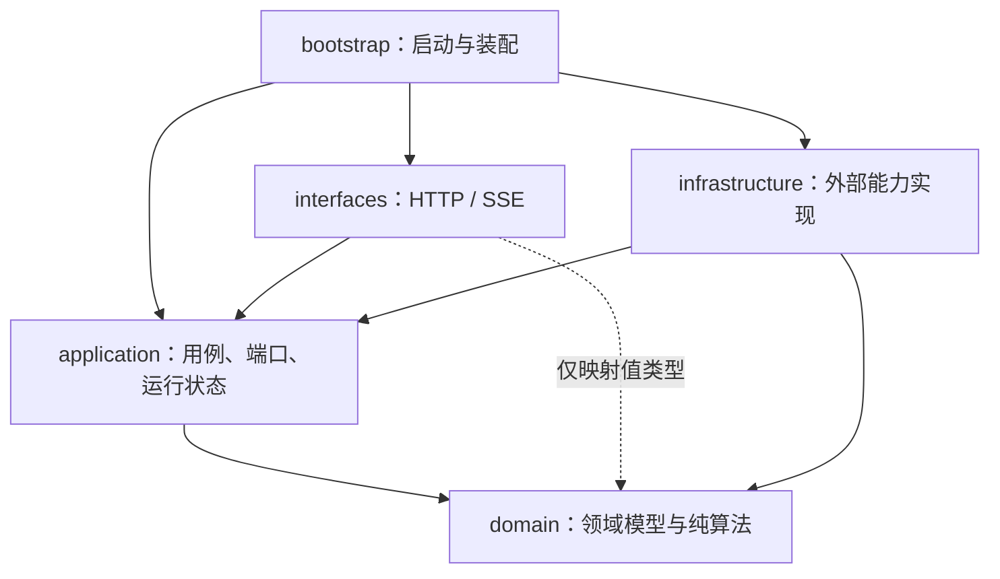
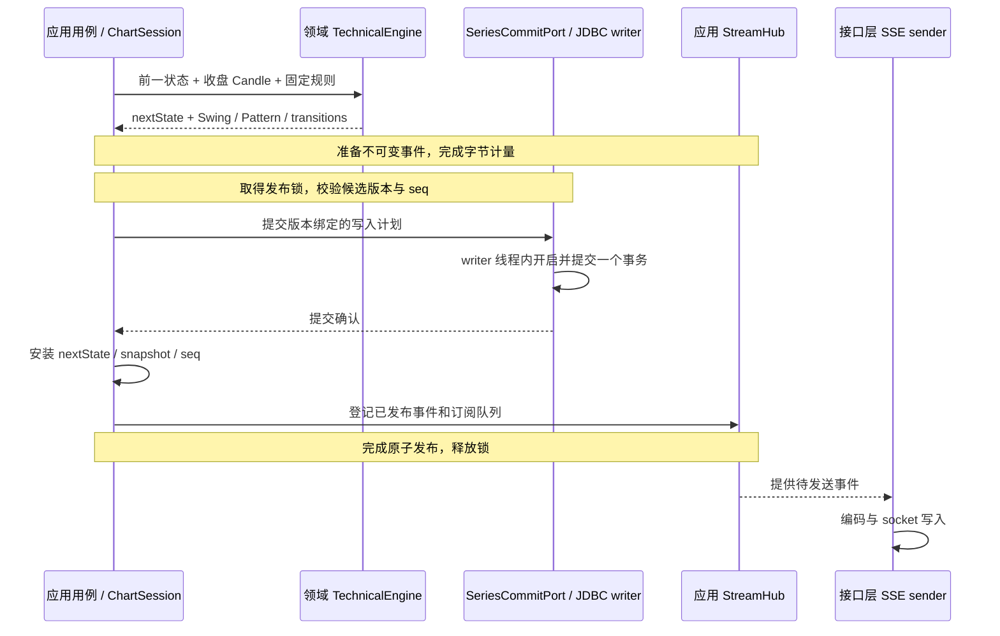

# Trading Coach 后端技术架构

状态：设计提案，后端语言已确定为 Java，应用尚未实现。依据：[数据源参考](market-data-design.md)、[API 契约](../shared/api-contracts.md)、[算法规则](technical-engine-spec.md)。

跨接口版本发布以 [一致性与恢复设计](consistency-and-recovery.md) 为准；容量、备份、恢复和升级以 [运行维护设计](operations.md) 为准。

## 1. 技术选择与运行边界

采用 Java 21 LTS、Spring Boot 4.1.x、Spring MVC、Jackson、Jakarta Validation、JDK HttpClient / WebSocket、Spring JDBC + Xerial SQLite JDBC。SSE 使用 Spring MVC `SseEmitter`。构建采用 Gradle Wrapper 和 Java toolchain 21；Gradle group 与 Java 根包统一使用 `com.marketaxiom`。实施时锁定兼容的补丁版本、Wrapper 和依赖，不使用动态版本。

MVP 部署一个 Spring Boot JVM 实例、一个 SQLite WAL 数据库。单实例内部运行 HTTP 请求、采集、序列处理、数据库写入和 SSE 发送任务；“单实例”不等于单线程。首版采用 Spring MVC + JDBC 的命令式模型，线程职责和队列边界见第 4 节。

后端负责上游数据接入、归一化、收盘确认、技术计算、快照一致性和实时推送。应用只读公共行情，不需要交易账户、不接订单执行。Java 选型基于用户的 Android / Java 背景和长期维护需求。旧 Python 实现仅供数据源行为参考。

## 2. 分层架构与代码组织

采用四层结构：接口层、应用层、领域层、基础设施层；另设启动装配入口。首版一个 Gradle 应用模块、一个部署单元，以 Java 包约束依赖；层不对应进程、线程或微服务。每层内部再按行情、图表、识别等职责组织，避免所有逻辑挤进一个 `Service`。

### 2.1 每层负责什么

| 层 / 包 | 负责 | 不负责 |
| --- | --- | --- |
| 接口层 `interfaces` | REST Controller、请求校验、HTTP / SSE DTO 映射、错误码、SseEmitter 与客户端连接生命周期 | 算法判定、SQL、直接修改 session 状态、决定提交顺序 |
| 应用层 `application` | 组织查询、采集、对账、收盘处理和重建用例；协调版本、事务请求、快照发布；管理 ChartSession、ReadContext 和 StreamHub | 交易所 JSON 解析、JDBC 操作、HTTP 响应格式、具体 Swing / Breakout 规则 |
| 领域层 `domain` | Candle、SeriesKey、规则配置等领域类型与不变量；TechnicalEngine、detector 和 Pattern 状态机；产生 nextState / 识别结果 | Spring、数据库、网络、队列调度、序列化、读取系统当前时间 |
| 基础设施层 `infrastructure` | 实现应用层定义的外部依赖接口：OKX / Fixture、HTTP / WebSocket、JDBC、事务执行、migration、限流和指标接入 | 决定形态含义、绕过用例修改 canonical state、决定何时公开新代 |
| 启动装配 `bootstrap` | Spring Boot 入口、配置绑定、Bean 装配、executor 配置、SmartLifecycle 启停顺序 | 业务判定和日常请求处理 |

应用层保留纯 Java 用例和接口，通过构造器注入依赖，由 bootstrap 创建 Bean；不要求每个类都有接口。只有入口用例和需要替换的外部能力定义边界。领域计算所需时间、参数和元数据由调用者显式传入，确保回放可复现。

### 2.2 依赖方向

下面箭头表示**代码依赖 / import**，不表示行情流动方向：



- `domain` 只依赖 JDK；`application` 只依赖 JDK 和 domain，不导入 Spring、Jackson、JDBC 或其他外层包。
- `interfaces` 通过 `application.port.in` 调用用例，以应用查询结果和事件作为输出；映射时可读取其中的 domain 值类型，不直接调用 detector 或取得可变 ChartSession。
- `infrastructure` 实现 `application.port.out`，可使用 domain 类型，不依赖 interfaces；应用层运行时通过端口调用这些实现，源码不反向导入具体实现。
- 其余层不依赖 bootstrap；interfaces 与 infrastructure 不互相调用。跨用例复用通过应用层协调组件完成，禁止形成循环依赖。

例如，应用层声明 `SeriesCommitPort`，基础设施层的 `JdbcSeriesCommitter` 实现它，bootstrap 负责注入。运行时是“用例 → 端口 → JDBC 实现”，代码依赖仍指向应用层。更换 SQLite 或行情 provider 时，保留用例与领域规则。

### 2.3 建议包结构

以下为未来应用结构，不代表当前已存在这些 Java 文件：

```text
trading-coach/backend/
  build.gradle / settings.gradle / gradlew / gradle/wrapper/
  src/main/java/com/marketaxiom/
    bootstrap/
      MarketAxiomApplication.java   # Spring Boot 入口，扫描整个根包
      config/                       # Bean、配置、executor 装配
      lifecycle/                    # SmartLifecycle 调用启动 / 停止用例
    interfaces/
      api/
        controller/                 # instruments、candles、chart、patterns、watchlist、health
        dto/                        # record DTO、Jakarta Validation
        mapper/                     # 应用结果 / 领域值 → HTTP / SSE DTO
        error/                      # RestControllerAdvice、统一错误 envelope
      stream/
        StreamController.java
        SseConnection.java          # SseEmitter、串行 sender、断开清理
    application/
      port/in/                      # 查询、订阅、采集启停等用例入口
      port/out/                     # MarketDataAdapter、仓储读接口、SeriesCommitPort
      model/                        # 命令、查询结果、事件、写入计划；无传输协议注解
      query/                        # Chart / Candle / Pattern / Watchlist 查询用例
      ingestion/                    # Collector、Reconciler、ProcessCandleUseCase
      rebuild/                      # RebuildSeriesUseCase、任务有效性与版本切换
      runtime/                      # ChartSession、ReadContextManager、StreamHub
    domain/
      model/                        # Candle、Instrument、SeriesKey、Swing、Pattern
      validation/                   # OHLC、时间边界等与 provider 无关的不变量
      technical/                    # TechnicalEngine、detector、PatternStateMachine
      rules/                        # 固定规则配置、版本与参数
    infrastructure/
      marketdata/
        okx/                        # OkxMarketDataAdapter、provider DTO、Normalizer
        fixture/                    # FixtureMarketDataAdapter
        transport/                  # JDK HttpClient / WebSocket、共享限流
      persistence/
        jdbc/                       # 仓储实现、SQL、数据库行映射
        writer/                     # JdbcSeriesCommitter、单 writer、有界队列
        migration/                  # schema migration 执行与校验
      observability/                # 指标 / 日志接入，实现应用层观测端口
  src/main/resources/
    application.yml
    db/migration/                   # 编号 SQL 与 migration 版本 / 校验和
  src/test/java/com/marketaxiom/  # unit、contract、integration、包依赖检查
  src/test/resources/fixtures/
```

`domain.technical` 表示算法的逻辑模块，首版不要求独立 Gradle 子模块。拆分构建模块应由实际复用或编译边界需要驱动，先保持目录、依赖规则和测试可执行。

`Market Axiom` 表达“以稳定、可验证的基本规则理解市场结构”，比偏展示含义的命名更符合规则引擎、历史重放和证据解释的定位。`com.marketaxiom` 是代码命名空间，不替代对外产品名 Trading Coach。仓库目录、HTTP 路径和 JSON 字段不跟随 Java 包名变化；根包一经开始实现就保持稳定，不在业务子包中混用两个命名空间。

### 2.4 模型、端口与状态的边界

| 边界 | 约定 |
| --- | --- |
| 外部行情 → 内部更新 | provider DTO 与字段映射留在 infrastructure；输出规范化更新，再由领域校验检查不变量。原始 JSON / JsonNode 不进入用例和算法 |
| 内部结果 → 公共协议 | 应用结果由 interfaces mapper 转成 DTO；领域价格为 BigDecimal，HTTP / SSE 为十进制字符串。JSON Schema 仍是唯一协议来源 |
| 内部结果 → 数据库 | SQL 行对象与行映射留在 infrastructure.persistence；不把 ResultSet、Connection 或数据库实体返回应用层 |
| 仓储接口 → 仓储实现 | CandleRepository / PatternRepository 等读接口定义在 application.port.out，JDBC 实现在 infrastructure。接口显式接收代与查询边界；不提供任意 SQL 或不带版本的“最新记录”查询 |
| 原子写入 → 事务执行 | 应用层提交不可变写入计划到 SeriesCommitPort；实现将 Candle、Swing、Pattern、transition、metadata 放在同一 writer 事务，不分别调用仓储提交 |
| 运行状态 → 领域状态 | ChartSession、epoch、seq、ReadContext、缓存与队列归应用层；EngineState 和形态生命周期归领域层。领域层不管理订阅与网络连接 |
| 逻辑事件 → SSE 发送 | StreamHub 归应用层，管理 session 的 ring、订阅、高水位、背压和逻辑队列；SseConnection 归接口层，负责序列化、send、心跳及连接清理 |

SSE 的字节预算不能用事件个数替代。接口层提供无副作用的事件编码 / 计量实现，由 bootstrap 注入应用层定义的端口，入队前取得准确的 UTF-8 字节数；应用层只持有不可变事件和计量结果，不导入 Jackson / SseEmitter。实际发送复用同一编码规则。snapshot、补发副本和实时队列分别按契约计费。序列处理器在取得发布锁前准备包含候选 epoch / seq 的不可变事件并完成计量；发布时验证状态仍匹配，不匹配则重新准备，不能在持锁期间重新编码。编码和网络写入不得持有 session 发布锁。

ReadContextManager 在应用层管理发布锁、版本与代引用；基础设施通过 `application.port.out` 中的读端口提供短期 `ReadSnapshot` 句柄，其类型不暴露 JDBC。建立数据库读取快照后才释放读许可，SQL 事务由实现关闭；HTTP / SSE 写出前已经释放句柄。不能只传 datasetRevision 再让每个 Repository 随意建立不同的读取快照，具体顺序见 [一致性设计](consistency-and-recovery.md#2-重建与原子发布)。

### 2.5 两条关键调用链

**查询图表 / 历史 / 详情：** Controller 校验请求并构造查询 → 应用查询用例取得 ReadContext → 读取该上下文的不可变快照或仓储读端口 → 结束短读事务与代引用 → 返回不可变应用结果 → mapper 转 DTO → HTTP 返回。缓存缺失时由用例组织受限回补并重新取得上下文，Controller 不直接请求交易所。

**处理已收盘 K 线：** OKX Adapter 规范化更新并通知 Listener → Collector 投递序列有界队列 → Reconciler 对账 → ProcessCandleUseCase 调用领域引擎计算独立 nextState → 请求原子写入 → 提交成功才安装状态、快照与事件 → SSE sender 异步发送。



图中为成功路径；回滚时不安装 nextState、不发布结果，提交结果不明则进入恢复流程。用例决定“一次业务变更写哪些结果、何时公开”；基础设施保证“同一连接上原子提交”。`TransactionTemplate` 只在 writer 线程内执行，不能在 Controller 或异步投递方法上加 `@Transactional` 就认为任务已被同一事务覆盖。

### 2.6 后续迭代与边界验收

| 变化 | 主要修改位置 | 需要保持的边界 |
| --- | --- | --- |
| 新增识别形态 | domain.technical / rules，以及必要的契约和映射 | detector 不访问数据库 / 网络；同一 fixture 可离线回放 |
| 新增交易所 | infrastructure.marketdata 的适配器与 bootstrap 装配 | 继续输出规范化更新，沿用应用层对账 / 发布流程 |
| 更换数据库 | infrastructure.persistence、migration、bootstrap 配置 | 通过相同读端口和原子写端口，重新验证一致性与恢复 |
| 新增 API / Android 客户端 | interfaces 与公共契约；需要新用例时扩展 application | 客户端沿用后端权威结果，不复制算法 |

P0 建立包依赖检查，并接入 Gradle `check`：拒绝领域 / 应用层引用外部框架、Controller 引用仓储实现、跨层循环依赖。P1 的领域测试无需启动 Spring 或数据库；应用用例用 fake 端口验证提交失败不发布、旧重建任务不安装；JDBC 原子性和 SSE 慢客户端通过集成测试验证。上述检查是实施验收要求，目前尚未生成应用代码或测试。

## 3. 服务职责与层级归属

| 组件 | 所属层 | 输入 / 输出与关键约束 |
| --- | --- | --- |
| MarketDataAdapter | 应用层端口 / 基础设施层实现 | REST / WS → NormalizedCandleUpdate；字段、周期与单位映射，无形态判断 |
| Collector / Reconciler | 应用层 | 连接 / 回补编排、去重与排序；closed 不退回 open，修正触发新代 |
| CandleValidator | 领域层 | 规范化 Candle → 不变量校验；不解析 provider JSON |
| CandleRepository / PatternRepository | 应用层读端口 / 基础设施层实现 | 在 ReadContext 的读取快照中查询固定代；稳定 ID、证据与历史分页 |
| TechnicalEngine | 领域层 | 顺序收盘 Candle → nextState / 识别结果；固定规则，无未来数据 |
| ProcessCandleUseCase / RebuildSeriesUseCase | 应用层 | 编排计算、原子写入、失败恢复和发布，禁止未提交结果进入公开快照 |
| SeriesCommitPort / JdbcSeriesCommitter | 应用层写端口 / 基础设施层实现 | 不可变写入计划 → 一个 writer 事务 → 提交确认 |
| ChartSession / ReadContextManager | 应用层 | 每序列串行状态、原子快照和统一版本读取入口 |
| StreamHub | 应用层 | session 事件日志、ring、seq / epoch、有限队列与重同步；不写 socket |
| Controller / mapper / SseConnection | 接口层 | 用例入口、协议映射、HTTP / SSE 发送和连接清理 |

## 4. 运行模型与启动

- 固定 instrument allowlist：OKX Spot BTC-USDT / ETH-USDT，六个周期，共 12 个序列。
- Collector 共享上游连接与 REST 限流器；不为每个浏览器建立交易所连接。
- 每个序列有独立 ChartSession、有界输入队列和串行处理器；同一序列的收盘、修正、状态变更严格按序处理，不同序列可并发。
- Watchlist 首版固定查询 `15m` 摘要，每 5 秒 REST 刷新，不另建大量订阅。
- UI 订阅只控制下游推送；固定序列持续采集，保证没有用户连接时形态仍连续。

线程与任务职责：

| 执行位置 | 职责 / 约束 |
| --- | --- |
| MVC 请求线程 | 参数校验、读取不可变快照、提交受限查询；不直接运行历史回放 |
| Collector / I/O executor | REST、重连、限流、历史下载；阻塞 I/O 可用 Java 21 虚拟线程，但仍限制并发请求数、队列和超时 |
| ChartSession 串行处理器 | 首版每序列一个受控处理任务；拥有 canonical state，快照读取和订阅登记由 session lock 协调 |
| 重建 executor | 固定并发上限和有界队列；从冻结的数据版本及收盘边界计算独立状态，完成后由 session 校验重建任务标识并安装；不并发修改运行中的状态 |
| SQLite writer | 一个有界队列、一个写线程，负责整个事务；不等待 session lock，不跨线程传播 JDBC 事务 |
| SSE sender | 每客户端串行发送、独立于采集和算法；可用虚拟线程，限制总连接数并保留每客户端有界队列 |

虚拟线程用于等待 I/O，不能增加 CPU 计算能力。所有 executor、定时器和连接由 Spring 管理并有明确 owner。WebSocket 回调只解析并投递；输入队列满时不静默丢弃收盘消息，标记 incomplete 并暂停该序列确认计算，通过断线重连和 REST 对账恢复；重建期间的暂存也必须有界。

启动顺序：配置验证 → 数据库 migration → 加载已收盘历史与规则版本 → 建立实时连接并暂存 → 历史回补 → 重建引擎 → 合并暂存与对账 → 标记可用。第一次历史准备允许各序列独立完成；未准备好的序列返回 `SERIES_WARMING_UP`。

停止顺序：拒绝新订阅 → 停止采集和重试定时器 → 关闭上游连接 → 在限定时间内排空已接收序列任务和数据库写队列 → 关闭 SSE、executor 和数据库。使用 Spring `SmartLifecycle` 协调资源顺序及 graceful shutdown；停止超时时不伪报完成，重启从最后已提交收盘位置回补。

## 5. 历史与实时一致性

1. 先启动实时连接并暂存更新，后拉历史，避免两者之间的空窗。
2. 历史数据校验后升序 upsert；缓存末尾允许一根未收盘 Candle。
3. 合并暂存数据、补齐 overlap，按 provider finality 与 revision 决定更新。
4. 对每个新收盘 Candle：以该 bar 开始前已知关键位计算突破 → 在独立 nextState 上推进 Swing / Structure → 事务写入数据与结果 → 安装 nextState、快照和新 seq → 发布批次。
5. 未收盘更新用于 Candle 与 provisional Pattern 展示，不推进确认 Swing，也不提前持久化确认事件。
6. 确认 Candle 的重复到达不重复计算或生成转换。

实时断线时保留最后图表，进入 `STALE`；从最后确认位置进行带重叠的 REST 回补，补齐后按顺序推进。新周期消息本身不足以证明前一根已收盘，优先取上游收盘标识，否则补请求确认。

历史已收盘数据修正先创建独立 BUILDING 代，旧 ACTIVE 代停止写入并继续提供标明 REBUILDING 状态的缓存结果。新代完整计算并追赶后，事务切换 ACTIVE 指针，再在发布锁内安装内存状态、更新 datasetRevision / epoch 并发送 reset / snapshot。BUILDING 数据不可被任何公开接口读到。请求通过统一 ReadContext 取得版本；所有历史和详情请求必须携带 epoch / datasetRevision。完整发布、失败与崩溃恢复步骤见 [一致性设计](consistency-and-recovery.md#2-重建与原子发布)。

## 6. 算法状态与重建

- 从数据库的完整已保留历史顺序重建，首版不保存 Java 对象序列化快照。后续 checkpoint 使用显式版本化的数据格式，包含规则、数据版本及最后处理位置，并验证与完整回放等价。
- 初次 bootstrap 获取最近 2,000 根/序列作为 analysis 起点；至少要满足 Swing 和可选成交量窗口。
- `analysisStartTime` 记录实际起点。滚动图表展示 500 根不改变引擎历史；历史分页也不改变 analysis 起点。
- 增加更早的 analysis 历史是显式重建操作：revision / epoch 更新，重新生成当前算法版本的结果。
- 首版保留已采集闭合 Candle；未来清理历史时必须先设计可恢复 checkpoint，不按图表缓存窗口删除引擎依赖数据。
- 重建按批读取，在独立 executor 中执行；记录耗时、处理条数和暂存深度。以持续增长的历史量验证恢复时间，超出约定恢复预算后再引入 checkpoint，不能在请求线程全量回放。
- 重建开始时暂停该序列的确认推进，冻结规则配置、数据版本和收盘边界，后续行情进入有界暂存；旧快照保留并标明质量状态。后台结果携带重建任务标识，过期任务结果丢弃；由 session 顺序对账暂存、完成对应持久化后安装新状态。暂存溢出则重新 REST 补齐，不把旧任务结果覆盖到更新的状态上。
- `engineVersion + parametersHash + instrumentMetadataVersion + datasetRevision + analysisStartTime` 共同界定结果；UI 能查看规则与分析元数据版本。重启从持久化的 ACTIVE 代读取固定配置，不以启动时最新元数据覆盖。

技术识别的完整默认参数及双向规则见算法文档。新增形态通过 detector 接口和状态规则注册，不新增 Agent。

## 7. 存储设计

| 表 | 唯一键 / 主要字段 | 用途 |
| --- | --- | --- |
| instruments | instrument_id；provider、market、provider_symbol、latest_metadata_version | 品种目录及最新观测元数据指针 |
| instrument_metadata_versions | instrument_id + metadata_version；base、quote、tick_size、volume_unit、observed_at、规范化内容 | 不可变元数据，分析代显式引用 |
| candles | instrument_id + timeframe + dataset_revision + open_time；OHLC、base_volume、quote_volume、revision、confirmed_at | 分代已收盘行情；十进制文本保存 |
| swings | instrument_id + timeframe + dataset_revision + swing_id；pivot_time、confirmed_at、price、relation、label | 可分页查询的历史识别结果，避免全部常驻内存 |
| pattern_instances | pattern_id + result_revision；type、anchor、状态、证据 JSON、规则版本 | 生命周期当前结果与修正后的结果版本 |
| pattern_transitions | pattern_id + result_revision + transition_index | 按顺序记录 canonical 状态转换，幂等写入 |
| series_metadata | instrument_id + timeframe；active_dataset_revision、next_dataset_revision | 当前公开代指针和单调分配器 |
| series_versions | instrument_id + timeframe + dataset_revision；BUILDING / ACTIVE / RETIRED / FAILED、engine_version、parameters_hash、instrument_metadata_version、analysis_start_time、last_processed_close_time、last_successful_process_at、build_task_id | 固定分析上下文及收盘恢复边界 |
| engine_configs | engine_version + parameters_hash；规范化配置 JSON | 固定判定配置 |

P0 的 DDL 必须落地复合主键、外键、每序列最多一个 ACTIVE 代的约束，以及 Candle 的序列 / 版本 / 时间索引、Swing 的序列 / 版本 / pivot_time 索引、Pattern 的序列 / 版本 / 状态 / 时间索引。ACTIVE 指针与代状态在同一事务更新；所有代内查询显式绑定 dataset_revision，不能通过全表 MAX(revision) 选结果。DDL 和 migration SQL 是 P0 交付物，目前仍为设计。

未收盘数据存内存，闭合后落库；重启重新从交易所获取未收盘 bar。Pattern provisional 只在内存，不进入 canonical 转换表。

单序列收盘写入在一个 SQLite 事务中完成：Candle + Swing + Pattern + transition + metadata。成功后才更新权威快照并发布事件；失败时保留上一版，进入 degraded 状态，不能先广播后声称已持久化。

算法计算产生独立的 nextState 和待写结果，不提前修改 canonical state。由 writer 在线程内执行 `TransactionTemplate`，提交成功后 session 在锁内安装新状态 / 快照并推进 seq；回滚则丢弃 nextState，暂停后续确认推进并从最后提交位置重试。若提交结果不明或数据库已提交但内存安装失败，先读取已提交 metadata 并重建，再接受新事件，避免重复转换。进程重启重建并更换 epoch。

SQLite 通过 Spring JDBC + Xerial 驱动访问；所有写入口（包括历史回补）共用 writer，整个事务使用同一连接。读连接不与写事务共用正在使用的 Connection，显式设置 WAL、foreign_keys、busy_timeout；WAL 启用结果须校验。历史导入分块并给实时写入留出调度机会，限制 SQLITE_BUSY 重试次数；监测 WAL 大小和 checkpoint 耗时，避免长读事务阻止回收。图表摘要缓存内存，API 查询不每次扫描全部 Candle。

migration 在采集启动前独占执行，记录版本和校验和，失败时 readiness 不通过。已确认 Candle 的冲突更新必须由 Reconciler 触发 revision / 重建流程，Repository 不得绕过它直接覆盖数据。SQLite 使用本机持久化目录；未来需要多实例或更高写入吞吐时再迁移 PostgreSQL，并重新验证事务和数值语义。

## 8. REST 与 SSE

REST 提供 instruments、历史分页、ChartSnapshot、Pattern Detail、Watchlist 和健康检查。SSE 推送一个序列的 Candle 与算法变化，协议见契约文档。

- ChartSession 拥有 boot/session epoch 与递增 seq；由 StreamHub 管理该 session 最近 512 个事件批次。
- 从 snapshot 到订阅之间通过 resume token 消除竞态；无法补齐时直接发完整快照。
- 每客户端队列最多 128 个批次；队列溢出时断开该客户端，由重连 + snapshot 恢复，不无限堆积，也不阻塞 collector。
- ring 同时限制 8 MiB，客户端实时队列同时限制 2 MiB。一次恢复最多补发 64 批 / 512 KiB，超过直接发完整快照；补发副本和实时队列独立计费，注册时划定 seq 高水位。细节见 [SSE 契约](../shared/api-contracts.md#9-sse)。
- 未收盘行情在进入 session 发布前可以合并到每秒最多 4 批；收盘、转换、quality/reset 不被合并丢弃。
- SSE 每 15 秒发注释心跳；客户端断开释放队列。
- `SseEmitter.send()` 在客户端专属发送任务中执行，不持有 session lock；发送异常、超时、完成回调均幂等清理订阅。Servlet 异步超时与代理超时分别配置，并通过慢客户端测试验证写阻塞不会拖住采集任务。
- 日志记录 stream key / epoch / seq，客户端数、队列深度、重建次数与拒绝数。

推送统一覆盖服务器最近最多 500 根的 liveWindow，浏览器视口不改变共享事件流。历史标注由 REST 分页提供，离开 liveWindow 的移除事件只影响客户端 live 集合；不会删除历史事实或其他浏览器数据。REST 和 SSE 都携带 processing 状态，使行情正常但识别暂停的情况可以被 UI 正确显示。

SSE 满足首版单向更新。以后若需要双向实时命令，可增加客户端 WebSocket Adapter，保持事件载荷语义。

## 9. 部署与配置

生产：Nginx / Caddy 提供 Web 静态产物与同域 `/api/v1/` 反向代理，Spring Boot 可执行 JAR / 容器绑定内部端口，运行于 Java 21。SSE 关闭代理缓冲和缓存，read timeout 大于心跳间隔；数据库目录使用持久卷。

```text
DATA_PROVIDER=fixture | okx
DATABASE_PATH=./data/trading-coach.sqlite3
INSTRUMENTS=BTC-USDT,ETH-USDT
TIMEFRAMES=1m,5m,15m,1h,4h,1d
ENGINE_VERSION=structure-breakout-v1
ANALYSIS_BOOTSTRAP_BARS=2000
SSE_RING_BATCHES=512
SSE_CLIENT_QUEUE_BATCHES=128
```

这些是建议环境变量名，由 `application.yml` 显式映射到 `@ConfigurationProperties` 并校验，尚未存在启动脚本。真实模式不允许找不到 Adapter 时隐式降级 fixture；错误配置启动失败。

单 JVM 应用实例是设计约束：不能直接把副本数调到 2 或同时启动两套应用，否则采集重复、内存快照和 seq 分裂。HTTP 线程、虚拟线程和后台 executor 均属于同一实例。需要扩容时先明确 Collector/Engine 的序列所有权，再引入共享存储或消息通道。MVP 保持模块化单体。

启动时对本地数据目录取得进程独占锁；升级采用维护窗口，数据库备份和 schema 兼容检查通过后再启动新构建。完整预算和操作顺序见 [运行维护](operations.md)，包括小时备份、恢复演练、磁盘告警和不兼容 schema 的回滚。

## 10. 错误、健康与性能验证

- 参数不支持返回 422；未知品种/形态返回 404；数据版本不匹配返回 409；限流 429；准备中或上游不可用且无缓存返回 503。
- 用 `@RestControllerAdvice` 将 Bean Validation、参数绑定和业务异常映射到统一错误 envelope，显式保留契约要求的 422，不能依赖框架默认错误页面 / 状态码。
- 数据缺口与旧缓存通过 quality 呈现；源接口失败不返回合法空数组冒充没有行情。
- `/health/live` 仅验证进程；`/health/ready` 验证数据库、配置、后台任务初始化。真实源延迟单独放 provider/series health，短断线不制造进程重启循环。
- SeriesQuality.processing 用 WARMING_UP / READY / REBUILDING / DEGRADED 描述识别处理状态，独立于连接状态；标明最后已提交收盘边界、最后成功处理时间和 reasonCodes。状态变化也发布 SSE status，即使没有新行情。
- 结构化日志包含 instrumentId、timeframe、provider、openTime、epoch、seq、规则版本，不含 token 或完整请求认证信息。

待测目标：12 个采集序列、10 个浏览器连接；缓存 snapshot p95 < 300ms；收到上游行情到发布批次 p95 < 500ms（合并等待另记）。这是设计预算，须在指定机器与真实负载下测量。

必要验证：JUnit 纯算法、Adapter payload fixture、REST/WS 接续、真实 SQLite 临时库的事务失败 / 重试、慢客户端、输入队列溢出、重启、历史修正、SSE 恢复和前后端契约。事务失败测试同时检查数据库、canonical state、seq 和快照；重建测试与实时订阅并行运行。不需要以交易收益验收。

## 11. Java 技术依据

核验日期：2026-10-06。版本兼容性依据 [Spring Boot 系统要求](https://docs.spring.io/spring-boot/system-requirements.html)；SSE 依据 [Spring MVC 异步请求](https://docs.spring.io/spring-framework/reference/web/webmvc/mvc-ann-async.html)；虚拟线程边界依据 [Java 21 文档](https://docs.oracle.com/en/java/javase/21/core/virtual-threads.html)。数据库采用 [Xerial SQLite JDBC](https://github.com/xerial/sqlite-jdbc)，事务边界依据 [Spring 编程式事务](https://docs.spring.io/spring-framework/reference/data-access/transaction/programmatic.html)。这些是技术设计依据，不代表依赖组合已构建或通过联调。
