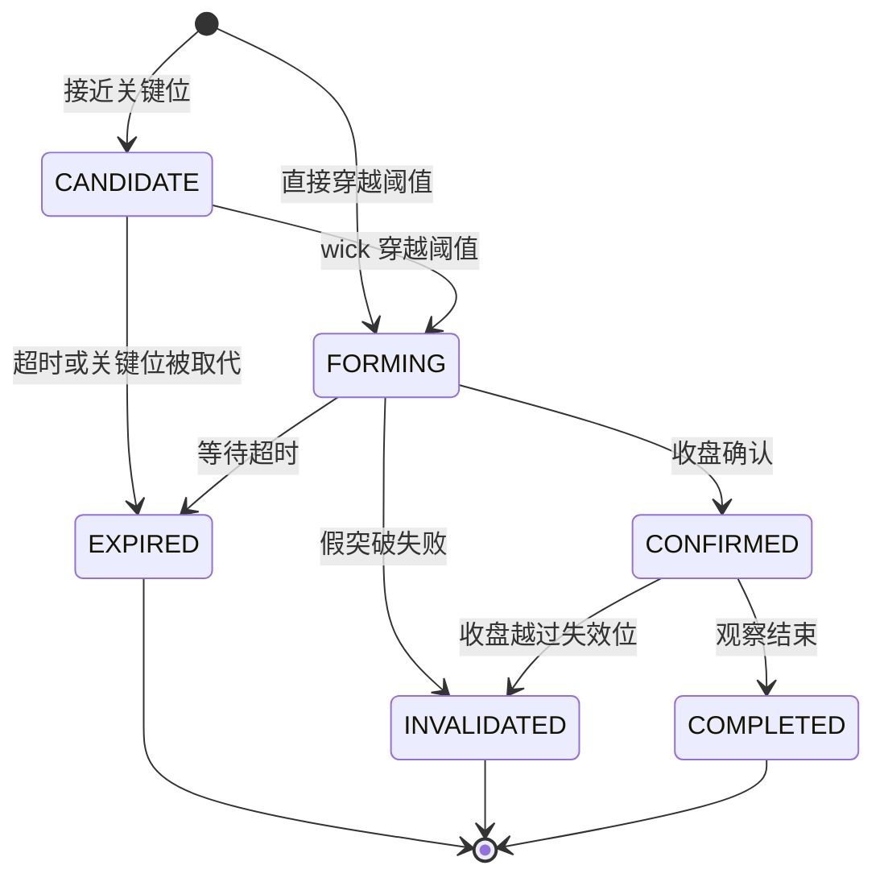

# Trading Coach 技术识别规则

状态：`structure-breakout-v1` 设计提案。目标是可解释和可复现，不声明预测能力。

本页补齐交接文档中没有固定的数学与时间规则。参数为首版起点，不代表已经通过真实数据评估；所有值进入版本化配置。

## 1. 引擎输入与时间规则

- 按 series 顺序输入经过校验的 Candle；canonical 算法只消费已收盘 bar。
- 相同已收盘 Candle 重复输入不推进状态；数据修正走重建，不当作新的 bar。
- 不跨缺口计算；补齐后顺序推进。没有足够历史时输出 UNKNOWN / reason，不虚构关键位。
- 以 bar.closeTime 作为 canonical evaluatedAt；firstSeenAt 单独记录系统实际发现时间。
- 先用 bar 开始前已知关键位判断该 bar 的突破，再确认新的 Swing / Structure。新确认 Swing 不能用于解释此前的突破。
- 未收盘 preview 从最近 canonical state 的副本计算，不能修改 canonical state。
- 每一分析代固定 instrumentMetadataVersion；输入行情、规则配置、分析起点与元数据共同决定结果。处理状态不是 READY 时暂停 preview 和确认推进，重建仅在独立状态上执行。

## 2. 默认参数

| 参数 | 初始值 | 含义 |
| --- | --- | --- |
| swingLeftBars / swingRightBars | 2 / 2 | 峰谷左右比较范围 |
| structureToleranceBps | 1 | 结构等价容差 |
| structureToleranceTicks | 2 | 最小等价容差为 2 个 tick |
| candidateDistanceBps | 100 | 接近关键位 1% 进入候选 |
| breakoutBufferBps | 5 | 突破 / 失效缓冲的相对分量 |
| breakoutBufferTicks | 2 | 缓冲最少 2 个 tick |
| volumeFilterEnabled | false | 首版默认不以成交量过滤 |
| volumeMaBars / volumeMultiplier | 20 / 1.5 | 开启过滤时的窗口与阈值 |
| candidateExpiryBars | 10 | 候选最多等待的收盘 bar 数 |
| formingExpiryBars | 3 | 形成阶段最多等待的收盘 bar 数 |
| observationBars | 10 | 确认后继续观察失效的 bar 数 |

所有价格、成交量和 bps 使用 Java `BigDecimal`：1 bps = 0.0001，从十进制字符串构造，不经 float / double 中转。tickSize 来自本分析代固定的 Instrument 元数据版本，不能在运行中替换。阈值以 tick 向外取整：向上突破/向上确认阈值使用 `RoundingMode.CEILING`，向下使用 `RoundingMode.FLOOR`；失效位也按方向向外取整。实现为阈值除以 tickSize、按方向取整数，再乘回 tickSize，不能仅按小数位数 setScale。

数值比较使用 `compareTo`，不使用区分 scale 的 `equals` 判断价格相等。参数采用字段顺序固定的规范化 JSON 计算 parametersHash，十进制参数统一为 `stripTrailingZeros().toPlainString()` 的字符串表示，避免 `1.0` 与 `1.00` 产生不同规则版本。成交量过滤用 `currentVolume × 窗口长度 > 历史成交量之和 × multiplier` 等价比较，避免均值除法的舍入改变阈值；任何其他除法须显式定义 scale / 舍入规则并加入边界测试。

## 3. Swing Detector

设待判断 bar 为 i，左右范围为 L/R。

- Swing High：`high[i]` 严格大于左侧 L 根和右侧 R 根的每一个 high。
- Swing Low：`low[i]` 严格小于左侧 L 根和右侧 R 根的每一个 low。
- 第 i+R 根收盘后才能确认。pivotTime 为 bar i 的 openTime，confirmedAt 为 bar i+R 的 closeTime。
- 相等极值平台不产生 Swing，避免凭任意 tie-break 选择峰谷；未来若支持平台识别，升级规则版本。
- 同一根 outside bar 同时满足高/低条件时两个 Swing 都保留，类型区分，不凭 OHLC 推测盘中先后。
- 已确认 Swing 持久化保留，不因出现更高/更低同类点删除旧点；引擎内存仅保留计算所需近期点、活跃 anchor 和公共 liveWindow，历史查询从仓库分页读取。

ID：hash(seriesKey、engineVersion、parametersHash、instrumentMetadataVersion、pivotTime、type)。已确认点在相同数据版本内不可改写。

## 4. 市场结构

每个新 HIGH 与前一个确认 HIGH 比较，每个新 LOW 与前一个确认 LOW 比较。容差为 `max(referencePrice × 1bps, 2 × tickSize)`。

| 类型 | 超过上界 | 低于下界 | 容差内 | 首个同类点 |
| --- | --- | --- | --- | --- |
| HIGH | HH | LH | EQUAL，不标 HH/LH | INITIAL |
| LOW | HL | LL | EQUAL，不标 HL/LL | INITIAL |

趋势由最近两个 HIGH 和最近两个 LOW 的关系共同确定：

- 最近高点关系 HIGHER 且低点关系 HIGHER → UPTREND。
- 两者均 LOWER → DOWNTREND。
- 两者均 EQUAL，且最近高点价格严格大于最近低点价格 → RANGE。
- 历史不足、最新 HIGH 与最新 LOW 的 pivotTime 相同（同一 outside bar）、HH+LL / LH+HL 等混合结构 → UNKNOWN。其中 outside bar 的歧义判断优先于方向和 RANGE 判断。

这是首版保守的横向结构定义；RANGE Pattern 的多次触碰、区间寿命和边界突破另行实现。不能把所有“不明确”都标成盘整。

每次趋势输出携带参与比较的 Swing IDs、asOf 和 reasonCodes。label 在 Swing 确认时固定，不因更晚出现的 Swing 反推改写历史。

## 5. 关键位

- Resistance = 最近确认的 Swing High；Support = 最近确认的 Swing Low。
- knownAt = Swing confirmedAt，关键位从下一根 bar 开始作为突破判定依据。
- 新同类 Swing 确认后，更新当前参考位；已有 Pattern 继续引用其冻结的 anchor，不随线条移动改变条件。
- 没有确认 Swing 不产生对应关键位；不通过整个历史最高价补出一个“已知阻力”。

## 6. Breakout 判定

对于冻结关键位 P，buffer B = max(P × 5bps, 2 × tickSize)，按 tickSize 向外取整阈值。

| 条件 | Bullish | Bearish |
| --- | --- | --- |
| 来源 | 已确认 Resistance | 已确认 Support |
| 候选接近 | close 在 [P×(1−1%), P] | close 在 [P, P×(1+1%)] |
| 形成 | high > P+B | low < P−B |
| 确认 | 已收盘 close > P+B | 已收盘 close < P−B |
| 确认后失效 | 已收盘 close < P−B | 已收盘 close > P+B |
| 假突破失败 | 形成后 close ≤ P | 形成后 close ≥ P |

跳空直接跨过阈值可以创建并确认 Pattern，不要求此前存在候选。等于确认阈值不确认；等于失效阈值不触发确认后失效。

成交量过滤开启时额外要求：`currentClosedVolume > mean(previous 20 closed volumes) × 1.5`。不含当前 bar，不使用 quote/base 混合单位。历史不足或均量为零不能通过过滤，返回明确 reason；关闭过滤时不显示 volumeRatio 作为确认依据。

每个 anchorSwingId + direction + ruleConfig + instrumentMetadataVersion 最多一个 canonical Breakout。失败或过期不重新创建相同 anchor 的候选；等待新 Swing。Retest 属于后续独立 Pattern，不复活原突破。

## 7. 生命周期

允许的 canonical 转换：

终止状态不可继续转换。具体条件与优先级以此表为准：

| 当前状态 | 条件（按优先级） | 下一状态 |
| --- | --- | --- |
| 无实例 | 接近关键位 | CANDIDATE |
| 无实例 / CANDIDATE | 已收盘 bar 的 wick 穿越形成阈值 | FORMING，随后同 bar 可继续确认或判失败 |
| CANDIDATE | 关键位被新 Swing 取代，或等待达到 10 根 | EXPIRED |
| FORMING | 收盘确认且可选量能过滤通过 | CONFIRMED |
| FORMING | 收盘回到关键位反侧或等于关键位 | INVALIDATED（FAILED_BREAKOUT） |
| FORMING | 尚未确认/失败，经过 3 根后 | EXPIRED |
| CONFIRMED | 后续收盘越过失效位 | INVALIDATED |
| CONFIRMED | 未失效，观察满 10 根后 | COMPLETED |

bar 计数按状态首次进入 bar 后的后续已收盘根数计；同 bar 确认计数为 0。同一 bar 上确认/失败判断优先于超时，确认后失效判断优先于观察结束。

INVALIDATED / EXPIRED / COMPLETED 是终止状态，设置 endTime。COMPLETED 只表示观察结束，不表示交易盈利。确认后观察期内关键位、buffer 和失效位保持冻结。

旧候选遇到新关键位：先完成本 bar 在旧关键位下的判断，再处理新 Swing；仍处于 CANDIDATE 时终止旧候选。已经 FORMING/CONFIRMED 的实例持续按原 anchor 管理。

## 8. 未收盘 preview 与历史一致性

实时 high/low 穿越阈值时可以显示 `FORMING + isProvisional=true`。这个 preview 不产生 canonical 确认、不写状态历史，后续更新允许撤回。

收盘时重新从上一个 canonical state 计算：以该 bar 的 OHLC 判断形成，再判断确认 / 失败，记录规范转换。因此历史批量和逐根收盘得到同一最终状态及 canonical 转换。比较时忽略 firstSeenAt、receivedAt 等实际运行时间，比较 ID、逻辑判定时间、状态、条件和证据；不能承诺历史 OHLC 重现所有盘中 preview 的时间和次数。

前端收到新的 canonical Pattern 必须替换相同 ID 的 provisional 视图；如果 preview 没有 canonical 对应物，显式移除。未来若需要完整盘中回放，必须保存逐笔/盘中事件，不能从 K 线反推。

## 9. 可解释输出

每个 Pattern 至少包含：anchorSwingId、level、buffer、判定 Candle、收盘价、方向、结构化确认/失效条件、规则版本、instrumentMetadataVersion、reasonCodes 和 canonical 状态历史。

建议 reasonCodes：`NEAR_RESISTANCE / NEAR_SUPPORT / WICK_ABOVE_THRESHOLD / WICK_BELOW_THRESHOLD / CLOSE_ABOVE_BUFFERED_RESISTANCE / CLOSE_BELOW_BUFFERED_SUPPORT / VOLUME_FILTER_PASSED / INSUFFICIENT_VOLUME_HISTORY / FAILED_BREAKOUT / CLOSE_BEYOND_INVALIDATION / CANDIDATE_EXPIRED / FORMING_EXPIRED / LEVEL_SUPERSEDED / OBSERVATION_COMPLETED / INSUFFICIENT_SWINGS / AMBIGUOUS_OUTSIDE_BAR / MIXED_STRUCTURE / EQUAL_SWING_RANGE`。

表达“规则识别为向上突破”“收盘仍缺确认”等可观察事实；不生成上涨概率或收益承诺。趋势不是 Breakout 的必要过滤条件，首版也不把 UNKNOWN 当作多头趋势。

## 10. 必要测试

| 测试 | 期望 |
| --- | --- |
| 左右 2 根确认 | pivot bar 出现时无结果，第 2 根右侧收盘后才输出 |
| 截断历史前缀 | 任意时刻的输出只依赖已知前缀，不使用未来数据 |
| 相等高/低平台 | 不输出未定义的 Swing |
| HH/HL、LH/LL、equal、混合 | 分别得到 UP、DOWN、RANGE、UNKNOWN |
| 同 bar 新 Swing 与突破 | 只允许使用该 bar 开始前已知的关键位 |
| 向上 / 向下、阈值相等、跳空 | 严格双向规则和边界结果正确 |
| BigDecimal scale、非 10 的幂的 tickSize、参数规范化 | `1.0` / `1.00` 数值一致；如 tickSize=0.05 正确向外取整；等价参数 hash 一致 |
| wick 越界但收盘返回 | canonical 形成后失败，不确认 |
| volume 关闭 / 不足 / 为零 / 通过 | reason 和结果与配置一致 |
| 候选超时、形成超时、确认失效、观察结束 | 终止状态、bar 计数和条件优先级正确 |
| 重复闭合 bar | Pattern ID / 转换数不增加 |
| 批量历史 vs 逐根收盘 | 同一 analysis 起点、配置和数据的 canonical 结果相同 |
| 未收盘多次更新 | 只改变 preview，不提前改变确认结果 |
| 数据修正 / 重启 | 同一规则和元数据重建可复现；新 revision 不混用旧结果 |
| 元数据变化 | 旧代 tickSize 固定；明确采用新版本后创建新代并重算，旧任务不能覆盖新结果 |

使用手工构造的小 OHLCV 序列作为 golden fixtures，覆盖边界；再用明确来源的真实样本做对照。首版不以回测收益作为识别正确性的证据。
